# Trabalho de redes - Free Router
Trabalho implementado por Sophie Dilhon (matricula: 2019107591).

O trabalho consistiu em implementar duas topologias, sendo a primeira com rotas estáticas e a segunda com rotas dinâmicas. Ambas são descritas nas seções seguintes.

## Topologia 1
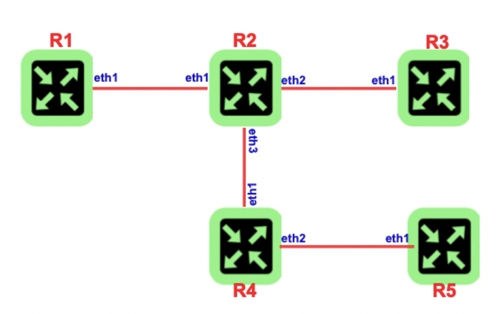
A primeira topologia consiste de 5 roteadores com rotas estáticas. Para isso, arquivos de hardware e software foram criados para cada um dos roteadores. Nos modelos abaixo:

```
# r2-hw.txt
int eth1 eth 0000.2222.0001 127.0.0.1 26021 127.0.0.1 26011
int eth2 eth 0000.2222.0002 127.0.0.1 26012 127.0.0.1 26022
int eth3 eth 0000.2222.0002 127.0.0.1 26031 127.0.0.1 26013
tcp2vrf 2223 v1 23


# r2-sw.txt
hostname r2
!
vrf definition v1
 exit
!
int eth1
vrf forwarding v1
exit
!
server telnet tel
 security protocol telnet
 no exec authorization
 no login authentication
 vrf v1
 exit
!

```

Neste exemplo, podemos ver o hardware do roteador r2, em que exitem três interfaces ethernet, a primeira o conecta ao roteador r1, a segunda ao roteador r3 e a terceira ao roteador r4. Por fim, definimos a porta deste roteador como 2223.
Podemos então acessá-lo com o comando:
```
telnet <localhost> <port=2223>
```
Agora devemos configurar o software deste roteador, os seguintes comandos foram usados para configurar a interface do ethernet 1:
```
conf t
int ethernet1 
vrf forwarding v1
ipv4 address 19.91.1.2 255.255.255.252
ipv6 address 2019:91:1::2 ffff:ffff:ffff:ffff::
no shutdown
do wr
end
```
Uma vez configurados as interfaces dos roteadores, devemos nos atentar aos roteadores que não possuem rota direta, pois nestes casos, ao rodar o comando ping, não haverá resposta. Dessa forma configuramos também as rotas estáticas. No caso do roteador r2 apenas configuramos uma rota estática (só não há ligação direta com r4):
```
conf t
ipv4 route v1 19.91.4.0 255.255.255.252 19.91.3.2 
ipv6 route v1 2019:91:4:: ffff:ffff:ffff:ffff:: 2019:91:3::2
do wr
end
```
Os endereços ipv4 e ipv6 dos roteadores estão descritos abaixo:
```
-> R1
    eth1: 19.91.1.1 | 2019:91:1::1
-> R2
    eth1: 19.91.1.2 | 2019:91:1::2
    eth2: 19.91.2.1 | 2019:91:2::1
    eth3: 19.91.3.1 | 2019:91:3::1
-> R3
    eth1: 19.91.2.2 | 2019:91:2::2
-> R4
    eth1: 19.91.3.2 | 2019:91:3::2
    eth2: 19.91.4.1 | 2019:91:4::1
-> R5
    eth1: 19.91.4.2 | 2019:91:4::2
```

Finalmente, podemos rodar o script para ligar todos os roteadores:
```
cd topologia_1
./start-freertr.sh
```

### Testes
#### Endereços
Com os comandos `show ipv4 route v1` e `show ipv6 route v1` podemos ver as rotas definidas para cada roteador.
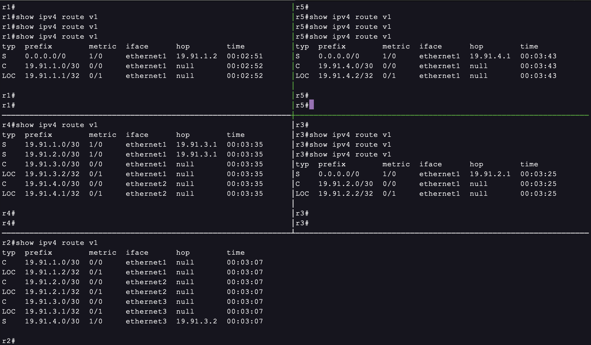
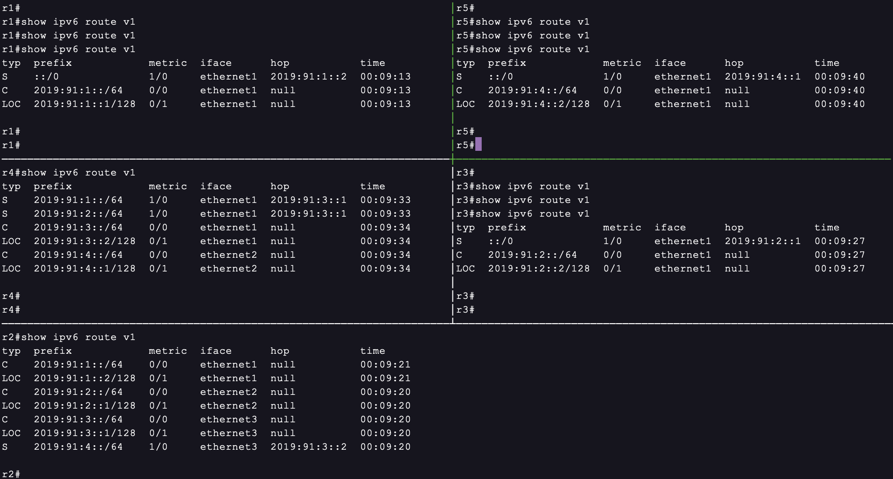

#### Ping e Traceroute
No roteador r2 vamos pingar os roteadores r1 e r5 com os comandos abaixo.

```
ping 19.91.1.1 vrf v1
ping 19.91.4.2 vrf v1
```
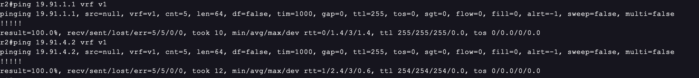

Podemos ver que os pacotes foram recebidos e não houve perda em ambos os casos!

Agora executando o comando traceroute do roteador r1 para o r5 podemos ver a rota percorrida.
```
traceroute 19.91.4.2 vrf v1
```
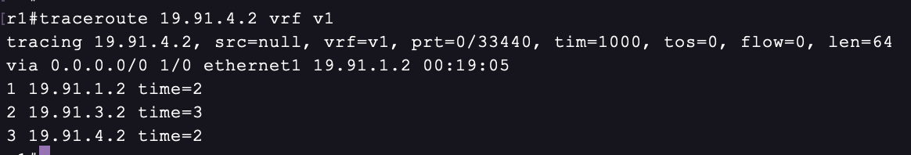

Podemos ver que os pacotes percorrem para o endereço `19.91.1.2` (roteador r2), em seguida vão para `19.91.3.2` (roteador r3), e por fim chegam a `19.91.4.2` (roteador r4).

#### Queda de enlace
Agora vamos ver o que acontece com os comandos executados na seção anterior caso a interface eth1 do roteador r4 não esteja ligada.

```
conf t
int eth1
shutdown
```

Para o ping, vemos que, como a conexão de r1 para r2 não foi desligada esta retorna uma resposta. Já para o ping de r2 para r5 não houve resposta, uma vez que o caminho foi interrompido.

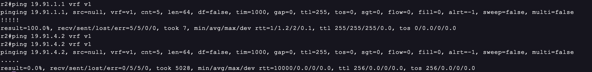

O mesmo pode ser observado quanto ao traceroute do roteador r1 ao r5, não houve resposta uma vez que o caminho foi cortado.
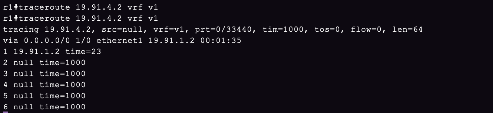


## Topologia 2
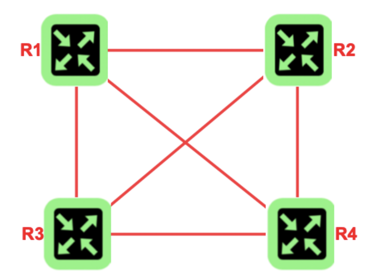

Para essa topologia vamos utilizar o algoritmo de roteamento chamado RIP. Inicialmente configuramos os 4 roteadores da mesma forma que foi feito para a topologia 1.

Os endereços ipv4 e ipv6 dos roteadores estão descritos abaixo:
```
-> R1
    eth1: 19.91.1.1 | 2019:91:1::1
    eth2: 19.91.2.1 | 2019:91:2::1
    eth3: 19.91.3.1 | 2019:91:3::1
-> R2
    eth1: 19.91.1.2 | 2019:91:1::2
    eth2: 19.91.4.1 | 2019:91:4::1
    eth3: 19.91.5.1 | 2019:91:5::1
-> R3
    eth1: 19.91.2.2 | 2019:91:2::2
    eth2: 19.91.4.2 | 2019:91:4::2
    eth3: 19.91.6.1 | 2019:91:6::1
-> R4
    eth1: 19.91.3.2 | 2019:91:3::2
    eth2: 19.91.5.2 | 2019:91:5::2
    eth3: 19.91.6.2 | 2019:91:6::2

```

Agora vamos configurar o protocolo RIP em cada um dos roteadores com os comandos a seguir:
```
conf t
router rip4 1
vrf v1 
red conn
exit
router rip6 1
vrf v1
red conn
exit
do wr
```
Por fim, para cada uma das interfaces dos roteadores devemos habilitar o protocolo com os comandos a seguir:
```
router rip4 1 enable
router rip6 1 enable
```

Finalmente, podemos rodar o script para ligar todos os roteadores:
```
cd topologia_2
./start-freertr.sh
```

### Testes
#### Endereços
Com os comandos `show ipv4 route v1` e `show ipv6 route v1` podemos ver as rotas definidas para cada roteador.
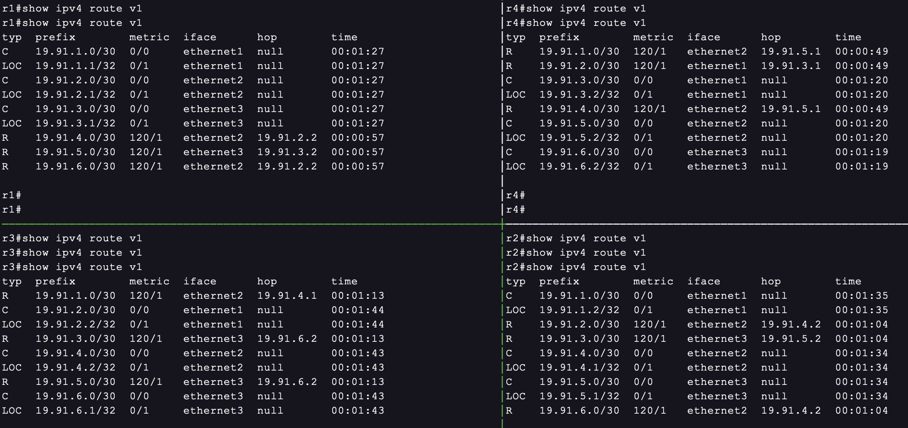
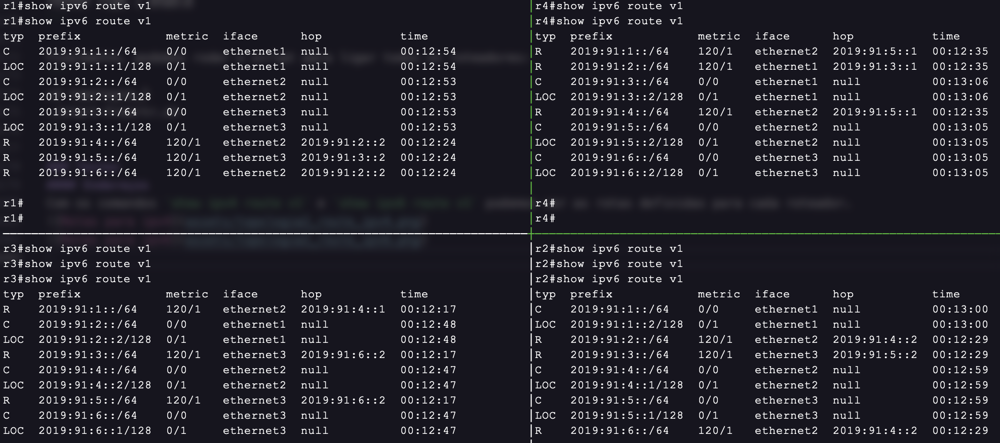

Ps: Após rodar o script é necessário aguardar alguns segundos para que os endereços sejam estabelecidos.

#### Ping e Traceroute
No roteador r1 vamos pingar o roteador r4, e com o comando `traceroute` ver a rota percorrida pelos pacotes.

```
ping 19.91.6.2 vrf v1
traceroute 19.91.6.2 vrf v1
```
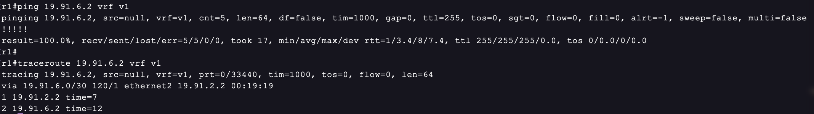

Podemos ver que, apesar do endereço passado não ser uma conexão direta do roteador r1 ao r4, os pacotes foram capaz de atingir o roteador final, uma vez que o protoclo já convergiu. No entanto, caso os comandos sejam utilizados antes disso ocorrer, podemos ver que os pacotes não chegam ao destino final uma vez que o caminho não é conhecido pelo roteador.

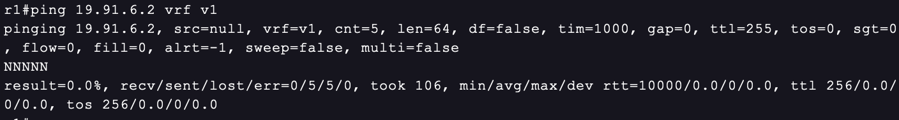


#### Queda de enlace
Agora vamos ver o que acontece com os comandos executados na seção anterior caso a interface eth1 do roteador r3 não esteja ligada.

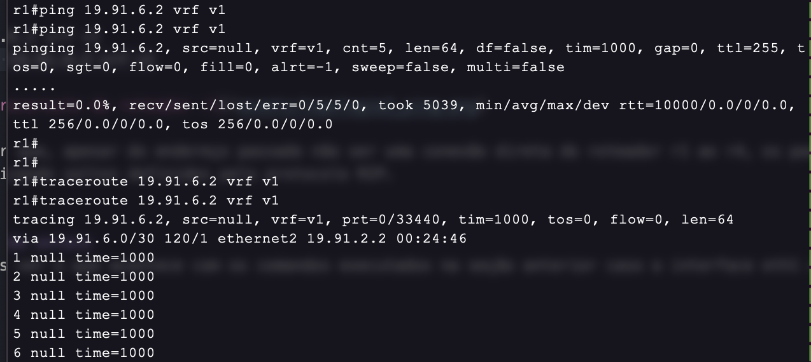

Podemos ver que desligando a interface eth1 de r3 não é mais possível alcançar o endereço pingado. No entanto, após algum tempo o protocolo é capaz de recalcular a rota, fazendo com que o endereço volte a ser visível mesmo sem a interface eth1 de r3 ligada.

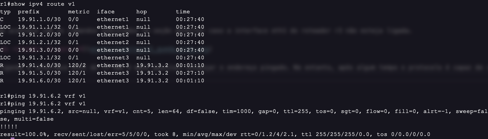
